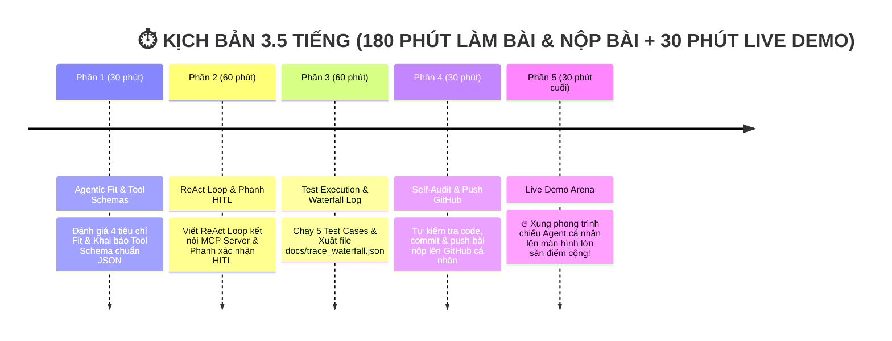

# 🏫 BÀI LAB 3: CHATBOT VS REACT AGENT — TỪ LÝ THUYẾT ĐẾN THỰC THI (MCP & SAFEGUARD ENHANCED)

> **Mã bài học:** `DAY03-REACT-AGENT`  
> **Hình thức thực hiện:** **CÁ NHÂN** *(Mỗi học viên tự làm và tự nộp 1 bài cá nhân)*  
> **Quy chuẩn nộp bài:** Học viên Fork Repo này về GitHub cá nhân và đổi tên theo đúng cú pháp:  
> 📌 **`K4-DAY03-<HoVaTen>_<MSSV>`** *(Ví dụ: `K4-DAY03-NguyenVanA_SV2026001`)*  

---

## 🎯 1. MỤC TIÊU DÀI HẠN CUỐI CÙNG (NORTH STAR GOAL)

Mục tiêu cốt lõi của Bài Lab này là giúp học viên tự tay phát triển một **Trợ lý Tác tử An toàn (Safe ReAct Agent)** hoàn chỉnh.

Thay vì chỉ sinh văn bản hội thoại đơn thuần như Chatbot cơ bản, tác tử (Agent) của bạn sẽ có khả năng:
1. **Tự suy luận và chọn công cụ:** Chủ động kích hoạt vòng lặp ReAct (`Thought -> Action -> Observation`) qua giao thức **Model Context Protocol (MCP)** để truy vấn dữ liệu thực tế.
2. **Cài phanh an toàn:** Tự động kích hoạt phanh **Human-in-the-loop (HITL)** xin phê duyệt từ con người trước khi thực thi các thao tác nhạy cảm (sửa hồ sơ, gửi email).
3. **Trích xuất bằng chứng (Trace Log):** Ghi lại file vết `trace_waterfall.json` chứng minh tính hiệu quả và độ tin cậy của tác tử so với Chatbot thông thường.

---

## 🏆 2. THÀNH QUẢ ĐẠT ĐƯỢC SAU BÀI LAB (WHAT YOU WILL MASTER)

Sau khi hoàn thành bài thực hành, học viên làm chủ **4 kỹ năng cốt lõi**:

* ✅ **Tư duy Agentic Fit:** Sử dụng bảng điểm Scoring Matrix để xác định bài toán nào cần nâng cấp lên Agentic System, bài toán nào chỉ cần Chatbot.
* ✅ **Lập trình ReAct Loop chuẩn MCP:** Nắm vững cơ chế ReAct Pattern trong bài giảng Day 3 và triển khai vòng lặp gọi công cụ qua giao thức chuẩn **Model Context Protocol (MCP)**.
* ✅ **Bảo mật & Phòng thủ Agent:** Cài đặt bộ lọc chặn tấn công **Prompt Injection** và phanh phê duyệt con người **Human-in-the-loop (HITL)**.
* ✅ **Đo lường Observability & Git Workflow:** Trích xuất file Waterfall Trace Log theo dõi độ trễ, số token tiêu thụ và thành thạo thao tác Git/GitHub.

---

## 🗺️ 3. LỘ TRÌNH ĐỌC TÀI LIỆU VÀ THỰC HÀNH THEO THỨ TỰ (READING ROADMAP)

Học viên vui lòng thực hiện bài thực hành theo đúng thứ tự 5 bước tài liệu dưới đây:

| Thứ tự | Tài liệu | Nội dung & Hành động |
| :---: | :--- | :--- |
| **Bước 1** | 📄 **`README.md`** *(Hiện tại)* | Đọc tổng quan bài học, mục tiêu và quy định nộp bài. |
| **Bước 2** | 📚 **`docs/DANH_SACH_DE_TAI.md`** | Lựa chọn 1 chủ đề thực tế phù hợp để triển khai bài thực hành. |
| **Bước 3** | 📊 **`docs/trace_eval.md`** | Điền bảng điểm Agentic Fit Scoring Matrix cho chủ đề đã chọn. |
| **Bước 4** | 🎓 **`docs/CODELAB.md`** | **[NỘI DUNG CHÍNH]** Thực hành từng bước hoàn thiện mã nguồn `src/`. |
| **Bước 5** | 📋 **`docs/SO_TAY_THUC_HANH.md`** | Kiểm tra Checklist tiến độ cá nhân & chuẩn bị cho phần Demo cuối buổi. |

---

## ⏱️ 4. PHÂN BỔ THỜI GIAN 3.5 TIẾNG (180 PHÚT LÀM BÀI + 30 PHÚT LIVE DEMO)



---

## 💡 5. KHUNG NỀN TẢNG LÝ THUYẾT (4 CẤP ĐỘ AI SYSTEM)

Nội dung bài Lab bám sát 100% Khung lý thuyết trong **Slide Day 3 (`day03-tu-chatbot-den-agentic-agent-react.pdf`)**:

| Cấp độ | Loại hệ thống | Đặc điểm kỹ thuật cốt lõi | Sự xuất hiện trong Bài Lab |
| :---: | :--- | :--- | :--- |
| **Cấp 1** | **Rule-Based Bot** | Khớp từ khóa `if/else` cố định, không có LLM | `src/ai_levels/level1_rule_based.py` |
| **Cấp 2** | **LLM Chatbot** | Dùng LLM sinh text mượt, không gọi được Tool | **Chatbot Baseline** (`run_baseline_chatbot`) |
| **Cấp 3** | **ReAct Agent (MCP-Enhanced)** | Vòng lặp ReAct `Thought->Action->Obs` + Phanh HITL | **ReAct Agent** (Trọng tâm Bài Lab) |
| **Cấp 4** | **Autonomous Agent** | Tự rã mục tiêu (Planning), tự học & có Memory | 🎁 **Phần Bonus Nâng cao (+10%)** |

---

## 📂 6. CẤU TRÚC THƯ MỤC DỰ ÁN

```text
📁 K4-Day03-Lab-Chatbot-vs-ReAct-Agent-MCP/
├── 📄 README.md                 <-- 📘 [ĐỌC ĐẦU TIÊN - BƯỚC 1] Tổng quan bài Lab & Đặt tên
├── 📄 .env.example              <-- 🔑 File cấu hình API Key (Gemini, OpenAI, Anthropic, Mock)
├── 📄 requirements.txt          <-- 📦 Thư viện Python cần cài đặt
│
├── 📁 config/
│   └── 📄 test_cases.json       <-- 🟢 Bộ 5 Test Cases thử thách Agent
│
├── 📁 src/                      <-- 💻 MÃ NGUỒN PYTHON
│   ├── 📄 mcp_server.py         <-- 🌐 MCP Server mô phỏng giao thức chuẩn mở
│   ├── 📄 tools.py              <-- 🛠️ Native Tool Schemas JSON
│   ├── 📄 prompts.py            <-- 🛡️ System Prompts, ReAct Pattern & HITL Guardrails
│   ├── 📄 providers.py          <-- 🔌 Multi-Provider LLM Adapter (Gemini/OpenAI/Mock)
│   ├── 📄 app.py                <-- 🚀 Core Agent App ghép nối ReAct Loop & Trace Log
│   └── 📁 ai_levels/            <-- 📚 Minh họa 4 Cấp độ hệ thống AI
│
└── 📁 docs/                     <-- 📚 TÀI LIỆU HƯỚNG DẪN CHUẨN VLEARN CODELAB
    ├── 📄 DANH_SACH_DE_TAI.md    <-- 💡 [BƯỚC 2] Danh sách chủ đề gợi ý
    ├── 📄 trace_eval.md          <-- 📊 [BƯỚC 3] Báo cáo Scoring Matrix & Waterfall Trace Log
    ├── 📄 CODELAB.md            <-- 🎓 [BƯỚC 4 - TRỌNG TÂM] Hướng dẫn thực hành Codelab từng bước
    └── 📄 SO_TAY_THUC_HANH.md   <-- 📋 [BƯỚC 5] Sổ tay thực hành cá nhân & Checklist
```

---

## 💯 7. THANG ĐIỂM ĐÁNH GIÁ (SCORING RUBRIC 100%)

| Tiêu chí | Trọng số | Mô tả chi tiết | Bằng chứng kiểm tra (Artifacts) |
| :--- | :---: | :--- | :--- |
| **1. Agentic Fit & Tool Specs** | **20%** | Phân tích đúng 4 tiêu chí Agentic Fit. Khai báo Tool Schema chuẩn JSON Schema. | Bảng Scoring Matrix (`docs/trace_eval.md`) + `config/test_cases.json`. |
| **2. ReAct Loop & MCP Integration** | **30%** | Vòng lặp ReAct chạy mượt mà qua Native Tool Calling & MCP Server. | Code trong `src/mcp_server.py` + `src/tools.py` + `src/app.py`. |
| **3. Guardrails & Phanh HITL** | **25%** | Chặn được Prompt Injection. Kích hoạt phanh con người HITL với tác vụ nguy hiểm. | File `src/prompts.py` + Test log `src/app.py`. |
| **4. Waterfall Trace & Git Push** | **25%** | File log `trace_waterfall.json` + Push bài nộp thành công lên GitHub cá nhân. | Link Repo GitHub cá nhân + File log trace. |
| 🎁 **BONUS: Live Demo Winner** | **+10%** | Học viên xung phong Demo Agent đứng vững trước các câu tấn công của lớp. | Trình diễn trực tiếp trên máy chiếu. |
| 🎁 **BONUS: Hacker Point** | **+1đ cá nhân**| Học viên dưới lớp giơ tay bẻ lái thành công Agent của bạn Demo. | Điểm cộng trực tiếp vào bảng điểm cá nhân. |

---

> [!TIP]
> **BƯỚC TIẾP THEO:** Sau khi đọc xong README, học viên mở file tài liệu tiếp theo theo đúng lộ trình:  
> 👉 **[Chuyển sang Bước 2: Xem Danh sách chủ đề gợi ý (docs/DANH_SACH_DE_TAI.md)](file:///d:/slide%20nhan%20tai%20AI%20VinUni/00_Tan_Binh/Kh%C3%B3a%204/Repo-Lab-k4/Day03/K4-Day03-Lab-Chatbot-vs-ReAct-Agent-MCP/docs/DANH_SACH_DE_TAI.md)**
