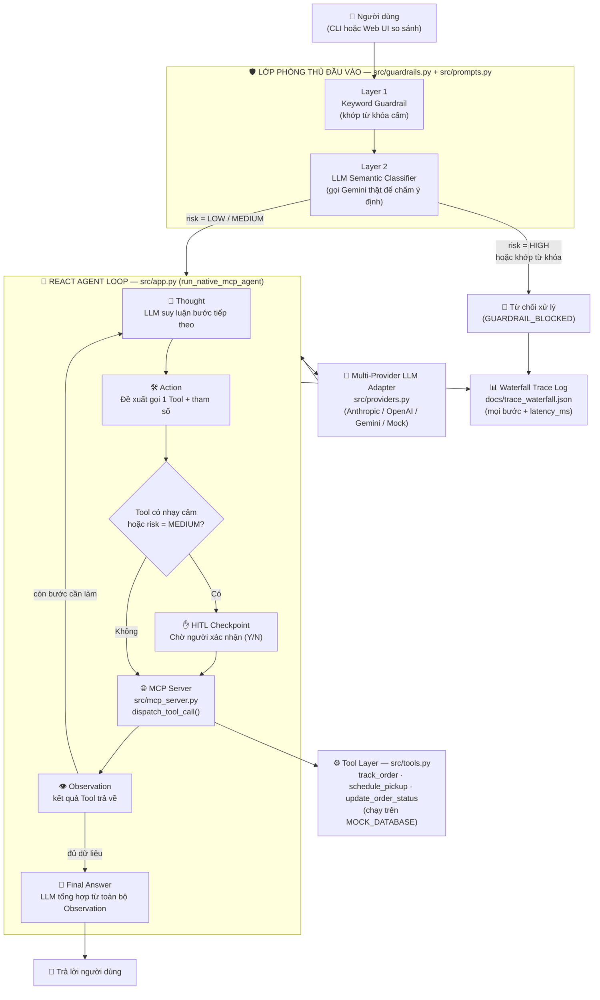

# 📄 BÁO CÁO TỔNG QUAN DỰ ÁN — SUPPLY CHAIN SAFE REACT AGENT

> **Họ và Tên Học viên:** Nguyễn Trần Kiên
> **Mã Học viên:** 2A202602571
> **Bài Lab:** K4 Day 03 — Chatbot vs ReAct Agent (MCP & Safeguard Enhanced)

---

## 1. Chọn đề tài gì? Tại sao chọn đề tài đó?

**Đề tài đã chọn:** Trợ lý Đơn hàng & Kho vận — *Supply Chain Agent* (mục 9 trong `docs/DANH_SACH_DE_TAI.md`), với 2 nghiệp vụ chính: *tra cứu mã vận đơn* và *cập nhật trạng thái đơn hàng*.

**Lý do chọn:**

1. **Điểm Agentic Fit cao nhất trong 10 đề tài đề xuất.** Khi chấm điểm cả 10 đề tài theo 4 tiêu chí Agentic Fit (xem `docs/DANH_SACH_DE_TAI.md` → phân tích so sánh), Supply Chain Agent đạt **17/20**, đồng hạng cao nhất cùng đề tài IT Helpdesk — vượt xa ngưỡng 12/20 để coi là "rất phù hợp triển khai Agentic System".
2. **Có chuỗi nghiệp vụ nhiều bước thật sự (multi-step), không phải tra cứu đơn lẻ.** Một yêu cầu thực tế như "kiểm tra đơn rồi đặt lịch lấy hàng" buộc Agent phải tự nối tiếp 2 Tool khác nhau dựa trên kết quả bước trước — rất phù hợp để minh hoạ đúng bản chất ReAct (Thought → Action → Observation) thay vì chỉ gọi 1 Tool là xong.
3. **Có hành động ghi dữ liệu nhạy cảm tự nhiên** (`update_order_status` — huỷ đơn/đổi trạng thái), phù hợp để minh hoạ phanh Human-in-the-loop (HITL) mà không cần bịa ra ngữ cảnh giả tạo.
4. **Gần với bài toán vận hành doanh nghiệp thật**, giúp bài Lab có tính ứng dụng cao hơn ví dụ học vụ mặc định.

---

## 2. Tại sao ReAct Agent Pattern lại phù hợp để giải quyết vấn đề này?

Một Chatbot LLM thuần (không Tool, không trạng thái) không thể giải quyết bài toán này vì nó không có dữ liệu thời gian thực và không thể tự thực hiện hành động (đặt lịch, đổi trạng thái). ReAct Agent giải quyết đúng khoảng trống đó bằng vòng lặp *Suy luận (Thought) → Hành động (Action/Tool Call) → Quan sát (Observation)* lặp lại đến khi đủ dữ liệu để trả lời.

Bảng chấm điểm Agentic Fit Scoring Matrix (chi tiết giải trình xem `docs/trace_eval.md`, mục 1):

| Tiêu chí Đánh giá | Điểm (/5) | Vì sao? |
| :--- | :---: | :--- |
| **1. Multi-step Reasoning** | 4 / 5 | Tra vận đơn → xét kết quả → mới quyết định đặt lịch lấy hàng hay cập nhật trạng thái. Không phải 1 lệnh tra cứu đơn lẻ mà là chuỗi 2-3 bước suy luận nối tiếp. |
| **2. Tool Interaction** | 4 / 5 | Cần kết nối MCP Server tới nhiều hệ thống khác nhau: quản lý kho/đơn hàng, đơn vị vận chuyển, hệ thống ghi nhận trạng thái — không thể trả lời chỉ bằng kiến thức nền của LLM. |
| **3. Dynamic Decision** | 5 / 5 | Bước kế tiếp (đặt lịch, huỷ đơn, hay chỉ trả lời) phụ thuộc HOÀN TOÀN vào observation vừa tra cứu được (đơn còn hàng, đã giao, hay bị delay) — đúng bản chất ReAct, không thể lập trình cứng trước. |
| **4. Long Horizon Goal** | 4 / 5 | Mục tiêu theo dõi đơn hàng kéo dài suốt vòng đời (xuất kho → vận chuyển → giao hàng), Agent phải giữ ngữ cảnh (đơn nào, đã xử lý bước gì) qua nhiều lượt. |
| **TỔNG ĐIỂM** | **17 / 20** | Vượt xa ngưỡng 12/20 → **rất phù hợp** triển khai ReAct Agent thay vì Chatbot tĩnh. |

Nói ngắn gọn: bài toán đòi hỏi Agent phải **tự quyết định có cần gọi Tool hay không, gọi Tool nào, và có cần dừng lại chờ con người phê duyệt hay không** — tất cả dựa trên dữ liệu quan sát được theo thời gian thực, chứ không thể trả lời trước bằng một kịch bản cố định. Đó chính xác là bài toán ReAct Agent Pattern được thiết kế để giải quyết.

---

## 3. Kiến trúc Agent đã xây dựng

Kiến trúc gồm 4 lớp: **Giao diện** (CLI `--interactive`/`--all` và Web UI so sánh chạy qua `src/web_server.py`) → **Phòng thủ đầu vào 2 tầng** (Layer 1 Keyword + Layer 2 LLM Semantic Classifier, gọi THẬT Gemini để đánh giá ý định câu hỏi) → **Vòng lặp ReAct Native Tool Calling** (có phanh HITL trước hành động nhạy cảm) → **MCP Server** (chuẩn hoá và thực thi Tool trên dữ liệu mock).

> **Cập nhật 13/09/2026:** Layer 2 trước đây chỉ là một danh sách từ khóa khác được gán trọng số rồi cộng theo công thức Noisy-OR — vẫn là so khớp chuỗi, không hiểu ngữ nghĩa. Đã sửa lại thành gọi thật một LLM (Gemini, qua `provider.generate()` đã cấu hình trong `.env`) làm bộ phân loại an ninh (security classifier) — model tự đọc và đánh giá Ý ĐỊNH câu hỏi, nên bắt được cả các câu diễn đạt lại (paraphrase) không hề trùng từ khóa nào. Công thức Noisy-OR cũ được giữ lại CHỈ làm phương án dự phòng khi chạy offline (Mock, chưa có API Key).

**Vai trò từng thành phần chính:**

- `src/guardrails.py` + `src/prompts.py` — 2 tầng phòng thủ đầu vào (Layer 1 Keyword & Layer 2 LLM Semantic Classifier) chạy TRƯỚC khi bất kỳ Tool nào được gọi.
- `src/app.py` — vòng lặp ReAct chính (`run_native_mcp_agent` cho CLI, `run_native_mcp_agent_resumable` cho Web UI), giữ `history` (các Observation đã thu thập) để LLM suy luận nhiều bước, và phanh HITL trước Tool nhạy cảm.
- `src/providers.py` — lớp adapter cho phép đổi qua lại giữa Anthropic / OpenAI / Gemini (`gemini-3.5-flash`) / chế độ Mock offline mà không cần sửa `app.py`.
- `src/mcp_server.py` — mô phỏng MCP Server, chuẩn hoá lời gọi Tool theo giao thức JSON-RPC.
- `src/tools.py` — khai báo Tool Schema (JSON Schema chuẩn) và logic thực thi trên dữ liệu mock.
- `src/web_server.py` — backend HTTP nhẹ (không cần Flask) phục vụ `docs/demo_ui.html` và 2 API (`/api/baseline`, `/api/agent` + `/api/agent/resume`) gọi THẬT lại đúng logic Python phía trên — Web UI không còn hardcode kịch bản nào bằng JavaScript.
- `docs/trace_waterfall.json` — nhật ký từng bước (Waterfall Trace Log) phục vụ observability.
- `docs/demo_ui.html` — giao diện Web so sánh trực quan Chatbot Baseline vs ReAct Agent trên cùng 1 câu hỏi (chạy qua `src/web_server.py`, tại `http://localhost:8787`).

---

## 4. Sử dụng những Tool gì? Tác dụng từng Tool?

Cả 3 Tool được khai báo chuẩn JSON Schema trong `src/tools.py` và công bố qua MCP Server (`src/mcp_server.py`):

| Tool | Tham số chính | Tác dụng |
| :--- | :--- | :--- |
| **`track_order`** | `order_id` | Tra cứu thông tin vận đơn và trạng thái hiện tại của đơn hàng (sản phẩm, kho xuất, đơn vị vận chuyển, vị trí hiện tại, ngày giao dự kiến). Đây là Tool "đọc" (read-only), không cần HITL, thường là bước đầu tiên của mọi chuỗi xử lý. |
| **`schedule_pickup`** | `order_id`, `pickup_datetime`, `carrier_name` | Đặt lịch lấy hàng (pickup) với đơn vị vận chuyển cho một đơn hàng cụ thể. Là Tool "ghi" nhưng không ảnh hưởng tới trạng thái đơn hàng gốc nên không thuộc danh sách nhạy cảm. |
| **`update_order_status`** | `order_id`, `new_status`, `reason` | **[NHẠY CẢM — bắt buộc HITL]** Cập nhật trạng thái đơn hàng (huỷ đơn, xác nhận giao thất bại, đổi trạng thái vận chuyển...). Vì đây là hành động ghi dữ liệu có thể gây hậu quả (huỷ đơn thật), Tool này nằm trong `SENSITIVE_TOOLS` (`src/prompts.py`) — Agent **bắt buộc phải dừng lại chờ con người xác nhận (Y/N)** trước khi thực thi. |

**Ghi chú:** ngoài 3 Tool nghiệp vụ trên, hệ thống còn có 2 tầng Guardrail (`check_input_prompt_injection` — khớp từ khóa, và `check_prompt_injection_llm` — gọi THẬT Gemini làm bộ phân loại ý định ngữ nghĩa, với `check_prompt_injection_probabilistic` chỉ làm dự phòng offline) chạy TRƯỚC vòng lặp Tool Calling; đây không phải Tool mà LLM có thể gọi, mà là lớp kiểm duyệt đầu vào bắt buộc, độc lập với LLM đang trả lời người dùng.
