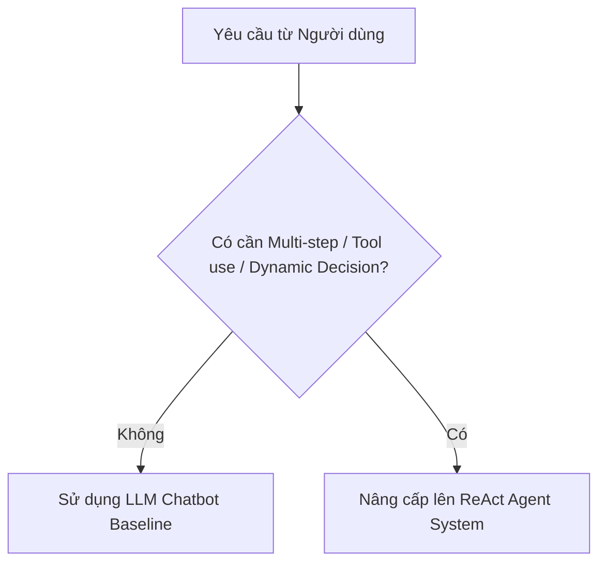

# 🎓 BÀI LAB 3: CHATBOT VS REACT AGENT — TỪ LÝ THUYẾT ĐẾN THỰC THI (MCP & SAFEGUARD ENHANCED)

Bài thực hành giúp học viên chuyển đổi tư duy từ viết Chatbot đơn thuần sang phát triển hệ thống **ReAct Agent** thông minh chuẩn công nghiệp 2026, ứng dụng giao thức **Model Context Protocol (MCP)** và cài đặt **Phòng thủ Đa lớp (Multi-layer Guardrails & HITL Checkpoint)**.

> 💡 **Mục tiêu đầu ra của Bài Lab:**  
> Sau khi hoàn thành bài Lab 180 phút, học viên sẽ nộp một sản phẩm cá nhân hoàn chỉnh: mã nguồn Agent chạy mượt mà ReAct Loop & Native Tool Calling, kết nối MCP Server, cài đặt phanh xác nhận con người (HITL) cho tác vụ nguy hiểm và trích xuất file Waterfall Trace Log chuẩn hóa.

📦 **Starter Repository Bài Lab 3:** [VinUni-AI20k/K4-Day03-Lab-Chatbot-vs-ReAct-Agent-MCP](https://github.com/VinUni-AI20k/K4-Day03-Lab-Chatbot-vs-ReAct-Agent-MCP) *(Cá nhân Fork về làm bài)*

---

## 📋 THÔNG TIN BRIEF & ĐÍCH ĐẾN BÀI LAB

- **Mục tiêu:** Xây dựng ReAct Agent kết nối MCP Server, cài phanh Human-in-the-loop (HITL) và xuất vết Waterfall Trace Log.
- **Người học / Day / Thời lượng:** Học viên Khóa 4 / Ngày 03 / 180 phút làm bài (Buổi học 240 phút - 4 tiếng).
- **Link nguồn Starter Repo:** `https://github.com/VinUni-AI20k/K4-Day03-Lab-Chatbot-vs-ReAct-Agent-MCP`
- **Hình thức:** Cá nhân làm bài 100% (`workMode: "individual"`).
- **Deliverable và cách kiểm tra:** Fork repo về GitHub cá nhân, đặt tên `K4-DAY03-HoVaTen-MSSV`. Kiểm tra qua file log `docs/trace_waterfall.json` và mã nguồn Python `src/`.

---

## 1. CHUẨN BỊ MÔI TRƯỜNG & FORK REPO (ĐA NỀN TẢNG)

Mỗi học viên tự làm việc trên môi trường máy tính của mình. Thực hiện theo đúng thứ tự các bước:

### Bước 1: Fork và Clone Repo
1. Mở trang Starter Repo GitHub và nhấn nút **Fork** về tài khoản cá nhân.
2. Đổi tên Repository theo chuẩn:
   📌 **`K4-DAY03-HoVaTen-MSSV`** *(Ví dụ: `K4-DAY03-NguyenVanA-SV2026001`)*
3. Clone Repo vừa fork về máy tính và mở bằng VSCode / IDE:
   ```bash
   git clone https://github.com/<tai_khoan_cua_ban>/K4-DAY03-HoVaTen-MSSV.git
   ```

### Bước 2: Tạo Môi trường ảo (Virtualenv) & Cài đặt Thư viện

**Trên macOS / Linux:**
```bash
python3 -m venv .venv
source .venv/bin/activate
pip install -r requirements.txt
cp .env.example .env
```

**Trên Windows (PowerShell):**
```powershell
python -m venv .venv
.venv\Scripts\Activate.ps1
pip install -r requirements.txt
Copy-Item .env.example .env
```
*(Nếu PowerShell chặn Script, chạy lệnh: `Set-ExecutionPolicy -ExecutionPolicy RemoteSigned -Scope CurrentUser`)*

**Trên Windows (Command Prompt - CMD):**
```cmd
python -m venv .venv
.venv\Scripts\activate.bat
pip install -r requirements.txt
copy .env.example .env
```

- [x] Đã Fork thành công Repo về GitHub cá nhân với tiền tố `K4-DAY03-`.
- [x] Đã kích hoạt môi trường ảo `(.venv)` và cài đặt thành công thư viện từ `requirements.txt`.

---

## 2. TASK 1.1 — ĐÁNH GIÁ 4 TIÊU CHÍ AGENTIC FIT

### Vì sao cần đánh giá Agentic Fit trước khi viết Code?
Không phải mọi bài toán đều cần đến Agent. Nếu một yêu cầu chỉ là tra cứu FAQ cố định hoặc viết lại văn bản, việc sử dụng Agent sẽ làm tăng thời gian phản hồi và chi phí token không cần thiết. Khung đánh giá Agentic Fit giúp bạn chọn đúng công nghệ phù hợp với bài toán.



### Thao tác thực hành:
1. Mở tệp `docs/DANH_SACH_DE_TAI.md` chọn 1 chủ đề bạn muốn xây dựng.
2. Mở tệp `docs/trace_eval.md` điền bảng chấm điểm **Agentic Fit Scoring Matrix** (chấm điểm từ 1 đến 5 cho 4 tiêu chí: *Multi-step Reasoning, Tool Interaction, Dynamic Decision, Long Horizon Goal*).
3. Mở tệp `config/test_cases.json` hoàn thiện 3 câu hỏi thử nghiệm `TC03`, `TC04`, `TC05` phù hợp với chủ đề đã chọn.

### 🚩 CHECKPOINT 1 (Mốc phút 30)
- **Tín hiệu hoàn thành (Pass Signal):** Bảng Scoring Matrix trong `docs/trace_eval.md` được điền đầy đủ điểm và giải trình. File `config/test_cases.json` không còn dòng `TODO`.
- **Nếu bạn bị chậm:** Chọn ngay Chủ đề 1 (Trợ lý Học vụ Sinh viên VinUni) có sẵn và điền nhanh điểm số để chuyển tiếp ngay sang Task 1.2.

---

## 3. TASK 1.2 — KHAI BÁO TOOL SCHEMAS CHUẨN JSON SCHEMA

### Thiết kế công cụ cho LLM:
Mô hình LLM hiểu công cụ thông qua định dạng cấu trúc JSON Schema. Một Tool Schema chuẩn phải mô tả rõ tên công cụ (`name`), mục đích sử dụng (`description`) và các kiểu dữ liệu của tham số đầu vào (`parameters`).

### Thao tác thực hành:
1. Mở tệp `src/tools.py`. Quan sát công cụ mẫu `academic_query` đã được định nghĩa sẵn.
2. Tìm mốc `# TODO 1.2` và hoàn thiện khai báo JSON Schema cho 2 công cụ còn lại:
   - `schedule_appointment`: Công cụ đặt lịch hẹn (cần tham số `student_id`, `datetime_str`, `advisor_name`).
   - `update_student_profile`: Công cụ cập nhật hồ sơ (cần tham số `student_id`, `field_to_update`, `new_value`).

**Cấu trúc Tool Schema mẫu tham khảo:**
```json
{
  "name": "academic_query",
  "description": "Tra cứu hồ sơ và thông tin học vụ của sinh viên VinUni bằng mã sinh viên.",
  "parameters": {
    "type": "object",
    "properties": {
      "student_id": {
        "type": "string",
        "description": "Mã sinh viên cần tra cứu (ví dụ: 'SV2026001')"
      }
    },
    "required": ["student_id"]
  }
}
```

- [x] Đã hoàn thiện khai báo đầy đủ 3 Tool Schemas trong danh sách `TOOLS_SCHEMA` tại `src/tools.py`.

---

## 4. TASK 2.1 — KẾT NỐI & KIỂM TRA MCP SERVER

### Giao thức Model Context Protocol (MCP):
MCP là tiêu chuẩn mở kết nối giữa Agentic Systems và các nguồn dữ liệu/công cụ bên ngoài. Trong kiến trúc này, công cụ không nằm trong LLM mà được phục vụ độc lập từ MCP Server (`src/mcp_server.py`).

### Thao tác thực hành:
1. Mở tệp `src/mcp_server.py` kiểm tra lớp `MCPAcademicServer`.
2. Kiểm tra hàm `call_tool(self, tool_name, arguments)` nhận yêu cầu và gọi `dispatch_tool_call()`.
3. Mở terminal và chạy lệnh kiểm tra MCP Server:
   ```bash
   python src/mcp_server.py
   ```

### 🚩 CHECKPOINT 2 (Mốc phút 70)
- **Tín hiệu hoàn thành (Pass Signal):** Terminal in ra thông báo:
  ```text
  ✅ [MCP SERVER] Đã khởi tạo thành công vinuni-academic-mcp-server (Version: 2026.1.0)
  📦 Số lượng Tools công bố qua MCP: 3
  ```
- **Nếu bạn bị chậm:** Kiểm tra lại lỗi cú pháp trong `src/tools.py`. Nếu gặp `SyntaxError`, đối chiếu với Tool Schema mẫu `academic_query` để sửa các dấu ngoặc nhọn `{}`.

---

## 5. TASK 2.2 — LẬP TRÌNH NATIVE REACT LOOP (`src/app.py`)

### Cơ chế ReAct Loop (Thought -> Action -> Observation):
Khác với Chatbot truyền thống chỉ trả về văn bản, ReAct Agent liên tục suy nghĩ (Thought), đề xuất gọi Tool (Action), nhận kết quả từ MCP Server (Observation) và đưa ra câu trả lời cuối cùng.

**Ví dụ cấu trúc vòng lặp ReAct Native Tool Calling:**
```python
# Gọi LLM với tham số tools chuẩn JSON Schema
response = provider.generate_with_tools(
    prompt=user_query,
    tools_schema=tools_list,
    system_prompt=SAFE_AGENT_SYSTEM_PROMPT
)

# MCP Server tiếp nhận request và thực thi tool độc lập
mcp_result = mcp_server.call_tool(tool_name, arguments)
```

### Thao tác thực hành:
1. Mở tệp `src/app.py` tìm hàm `run_native_mcp_agent()`.
2. Quan sát cấu trúc vòng lặp `while step < MAX_ITERATIONS:` xử lý 2 trường hợp:
   - Khi LLM trả về `type == "text"`: In kết luận và dừng vòng lặp.
   - Khi LLM trả về `type == "tool_call"`: Gọi MCP Server thực thi và nạp kết quả Observation cho lượt kế tiếp.

---

## 6. TASK 3.1 — CÀI ĐẶT PHÒNG THỦ INPUT GUARDRAIL

### Chặn đứng tấn công Prompt Injection:
Prompt Injection là hình thức câu lệnh chứa mã độc cố tình bẻ khóa System Prompt của Agent. Ta cần dựng lớp phòng thủ đầu tiên trước khi câu hỏi được gửi tới LLM.

### Thao tác thực hành:
1. Mở tệp `src/prompts.py` tìm hàm `check_input_prompt_injection()`.
2. Tìm mốc `# TODO 3.1` và hoàn thiện logic duyệt qua danh sách `INJECTION_KEYWORDS`. Nếu câu hỏi chứa từ khóa nguy hại, trả về `(True, "Cảnh báo...")`.

- [x] Bộ lọc Input Guardrail phát hiện và chặn đứng câu hỏi nghi vấn trong bài test `TC05`.

---

## 7. TASK 3.2 — KÍCH HOẠT PHANH XÁC NHẬN CON NGƯỜI (HITL)

### Nguyên tắc an toàn: LLM Decides, Application Executes
Mô hình LLM chỉ đóng vai trò đề nghị công cụ và tham số. Ứng dụng bọc ngoài (Agent Harness) đóng vai trò kiểm duyệt an toàn trước khi thực thi lệnh thực tế.

> ⚠️ **Cảnh báo Bảo mật (Security Guardrails):**  
> Đối với các hành động có mức độ rủi ro cao hoặc thay đổi dữ liệu (`update_student_profile`), hệ thống bắt buộc kích hoạt phanh **Human-in-the-loop (HITL)** yêu cầu con người xác nhận trước khi ghi dữ liệu!

### Thao tác thực hành:
1. Mở tệp `src/app.py` kiểm tra vị trí phanh `is_sensitive_tool(tool_name)`.
2. Khi gặp tool nhạy cảm, Agent in thông báo cảnh báo và yêu cầu xác nhận `(Y/N)`.

### 🚩 CHECKPOINT 3 (Mốc phút 130)
- **Tín hiệu hoàn thành (Pass Signal):** Chạy thử nghiệm và thấy rõ 2 cơ chế bảo vệ hoạt động:
  - Input Guardrail chặn đứng các câu bẻ khóa System Prompt.
  - Phanh HITL hiển thị thông báo `[HITL WARNING]: Tool 'update_student_profile' là hành động nhạy cảm!`.
- **Nếu bạn bị chậm:** Sử dụng chế độ mặc định `interactive_hitl = False` trong `src/app.py` để hệ thống tự động gắn nhãn an toàn mô phỏng mà không làm nghẽn luồng kiểm thử.

---

## 8. TASK 4.1 — CHẠY TEST SUITE & TRÍCH XUẤT TRACE LOG

### Quan sát hệ thống qua Waterfall Trace Log:
Quan sát là yếu tố sống còn trong quản trị Agentic Systems. Bài Lab tự động trích xuất file log `docs/trace_waterfall.json` thể hiện độ trễ (latency_ms) và cây thực thi từng bước.

### Thao tác thực hành:
1. Mở terminal và thực thi bài lab qua các chế độ kiểm thử linh hoạt:
   - **Chạy toàn bộ 5 Test Cases:**
     ```bash
     python src/app.py --all
     ```
   - **Trò chuyện đàm thoại trực tiếp nối tiếp (Interactive Chat CLI):**
     ```bash
     python src/app.py --interactive
     ```
     *(Gõ thử các câu prompt tra cứu, đặt lịch hoặc bẻ khóa agent. Gõ `exit` hoặc `quit` để thoát phiên chat).*
   - **Trải nghiệm Giao diện Web trực quan (Web UI):**
     Mở file `docs/demo_ui.html` trực tiếp bằng trình duyệt Chrome/Edge để trải nghiệm chat 2 cột so sánh Chatbot vs Agent và quan sát Waterfall Trace thời gian thực.
2. Mở file `docs/trace_waterfall.json` kiểm tra cấu trúc log.
3. Mở file `docs/trace_eval.md`, dán 1 đoạn trích xuất trace log và điền tổng kết bài kiểm thử vào Mục 2 & Mục 3.

- [x] File log `docs/trace_waterfall.json` được tạo thành công với đầy đủ các bước thực thi.
- [x] Đã thử nghiệm thành công chế độ đàm thoại trực tiếp `python src/app.py --interactive`.
- [x] Đã hoàn thiện toàn bộ biên bản kiểm thử trong `docs/trace_eval.md`.

---

## 9. TASK 4.2 — ĐÓNG GÓI REPO CÁ NHÂN & NỘP BÀI LMS

### Thao tác nộp bài cá nhân:
1. Kiểm tra lại `git status` đảm bảo không sót file mã nguồn nào chưa lưu.
2. Thực hiện Commit và Push lên GitHub cá nhân:
   ```bash
   git add .
   git commit -m "feat: complete Day 03 Lab Native MCP ReAct Agent and Guardrails"
   git push origin main
   ```
3. Truy cập vào Repository trên GitHub cá nhân, kiểm tra cây thư mục đảm bảo có đủ các file trong `src/`, `config/test_cases.json`, `docs/trace_waterfall.json` và `docs/trace_eval.md`.

### 🚩 CHECKPOINT 4 (Mốc phút 180 - NỘP BÀI)
- **Tín hiệu hoàn thành (Pass Signal):** Link GitHub Repository `https://github.com/<tai_khoan>/K4-DAY03-HoVaTen-MSSV` đã được sao chép và dán vào ô nộp bài trên LMS VLearn.
- **Nếu bạn bị chậm:** Dù chưa hoàn thiện trọn vẹn 100% tính năng nâng cao, hãy commit và push những gì đã hoàn thành lên GitHub đúng hạn để lấy điểm tiến độ!

> ✅ **Hướng dẫn Nộp bài VLearn:**  
> Học viên dán URL Repository GitHub cá nhân vào ô nộp bài trên hệ thống LMS VLearn để hoàn tất buổi học.

---

## 10. 🚨 TRẠM CỨU HỘ SỰ CỐ & FAQS

### Các lỗi thường gặp và cách khắc phục nhanh:
- **Lỗi 1: `ModuleNotFoundError: No module named 'dotenv'`**  
  -> Môi trường ảo chưa được kích hoạt hoặc chưa chạy lệnh `pip install -r requirements.txt`. Chạy lại Bước 2 ở Phần 1.
- **Lỗi 2: Terminal Windows báo lỗi `ExecutionPolicy` khi kích hoạt `.venv`**  
  -> Chạy lệnh: `Set-ExecutionPolicy -ExecutionPolicy RemoteSigned -Scope CurrentUser` trong PowerShell rồi thử lại.
- **Lỗi 3: Không xuất hiện file `docs/trace_waterfall.json` sau khi chạy `app.py`**  
  -> Đảm bảo bạn đang đứng ở thư mục gốc của dự án khi gõ lệnh `python src/app.py`.

---

🔗 **Đường dẫn chuyển tiếp tài liệu:** [Đọc Sổ tay Thực hành Cá nhân (SO_TAY_THUC_HANH.md)](file:///d:/slide%20nhan%20tai%20AI%20VinUni/00_Tan_Binh/Kh%C3%B3a%204/Repo-Lab-k4/Day03/K4-Day03-Lab-Chatbot-vs-ReAct-Agent-MCP/docs/SO_TAY_THUC_HANH.md)
