# 📋 SỔ TAY THỰC HÀNH CÁ NHÂN & CHECKLIST TIẾN ĐỘ (BƯỚC 5)

---

## 🎯 HÌNH THỨC THỰC HIỆN: CÁ NHÂN

Bài thực hành thiết kế dành cho cá nhân học viên làm chủ quy trình phát triển Tác tử AI (AI Agent):
- Mỗi học viên tự Fork Repo về GitHub cá nhân.
- Tự hoàn thiện mã nguồn, tự đẩy bài nộp và sẵn sàng tham gia màn Demo cuối buổi.

---

## ⏱️ LỘ TRÌNH THỰC HÀNH 4 TIẾNG (240 PHÚT)

```mermaid
gantt
    title KỊCH BẢN 4 TIẾNG (180 PHÚT LÀM BÀI/NỘP BÀI + 60 PHÚT LIVE DEMO & BUFFER)
    dateFormat  m
    axisFormat %M m
    
    Phần 1: Agentic Fit & Tool Schemas       :m1, 0, 30m
    Phần 2: Core Native Agent & HITL          :m2, after m1, 60m
    Phần 3: Test Execution & Debug            :m3, after m2, 60m
    Phần 4: Self-Audit & Push GitHub Nộp bài :m4, after m3, 30m
    Phần 5: Live Demo Săn điểm cộng & Buffer :m5, after m4, 60m
```



---

## 📝 CHECKLIST CÁ NHÂN THEO TỪNG MỐC THỜI GIAN

### 🔷 PHẦN 1 (30 phút — Phút 00 -> 30): Đánh giá Agentic Fit & Tool Schemas
* [ ] Chọn 1 chủ đề thực tế từ tệp `docs/DANH_SACH_DE_TAI.md`.
* [ ] Điền bảng Scoring Matrix 4 tiêu chí Agentic Fit vào file `docs/trace_eval.md`.
* [ ] Khai báo ít nhất 2 Tool Schemas đúng chuẩn JSON Schema vào file `src/tools.py`.
* [ ] Thêm 5 câu test case thực tế vào file `config/test_cases.json`.

---

### 🔷 PHẦN 2 (60 phút — Phút 30 -> 90): ReAct Agent & Phanh HITL
* [ ] Tích hợp giao thức MCP Server mô phỏng trong `src/mcp_server.py`.
* [ ] Lắp ráp vòng lặp ReAct Native Tool Calling trong `src/app.py`.
* [ ] Cài đặt bộ lọc Input Prompt Injection trong `src/prompts.py`.
* [ ] Cài đặt phanh **Human-In-The-Loop (HITL)** yêu cầu xác nhận con người (`Y/N`) với tác vụ nhạy cảm (`update_student_profile`).

---

### 🔷 PHẦN 3 (60 phút — Phút 90 -> 150): Chạy Kiểm thử & Xuất Trace Waterfall Log
* [ ] Chạy lệnh `python src/app.py` cho 5 test cases.
* [ ] Kiểm tra file vết `docs/trace_waterfall.json` xuất ra đầy đủ độ trễ (latency_ms) và chi tiết các bước.
* [ ] Dán đoạn Trace log tóm tắt vào file `docs/trace_eval.md`.

---

### 🔷 PHẦN 4 (30 phút — Phút 150 -> 180): Tự kiểm tra & Nộp bài Git/GitHub
* [ ] Kiểm tra tên Repo cá nhân đúng chuẩn: **`K4-DAY03-<HoVaTen>_<MSSV>`**.
* [ ] Chạy lệnh Git để push toàn bộ mã nguồn lên GitHub cá nhân:
  ```bash
  git add .
  git commit -m "Complete Lab 3 Native MCP Safe Agent"
  git push origin main
  ```
* [ ] Nộp link Repo GitHub cá nhân lên hệ thống VLearn.

---

### 🔥 PHẦN 5 (60 phút cuối — Phút 180 -> 240): LIVE DEMO ARENA — SĂN ĐIỂM CỘNG

1. **Thể lệ tham gia:**
   * Học viên xung phong mang laptop lên kết nối máy chiếu.
   * Trình chiếu trực tiếp Agent cá nhân trên màn hình lớn.
2. **Cơ chế săn điểm cộng:**
   * **Học viên bên dưới:** Giơ tay đọc trực tiếp câu Prompt Injection / Jailbreak độc hại tấn công Agent trên máy chiếu. Nếu bẻ lái thành công $\rightarrow$ Được **+0.5 đến +1.0 điểm cộng cá nhân**.
   * **Học viên Demo:** Nếu Agent phòng thủ tốt (chặn được lệnh hoặc phanh HITL nhảy ra hỏi xác nhận Y/N) $\rightarrow$ Được **+10% điểm Bonus Capstone**!

---

> [!NOTE]
> **HOÀN THÀNH QUY TRÌNH:** Học viên đã xem xong Sổ tay thực hành. Để quay lại Trang chủ xem lại tổng quan bài học:  
> 👉 **[Quay lại Bước 1: Trang chủ README.md (README.md)](file:///d:/slide%20nhan%20tai%20AI%20VinUni/00_Tan_Binh/Kh%C3%B3a%204/Repo-Lab-k4/Day03/K4-Day03-Lab-Chatbot-vs-ReAct-Agent-MCP/README.md)**
